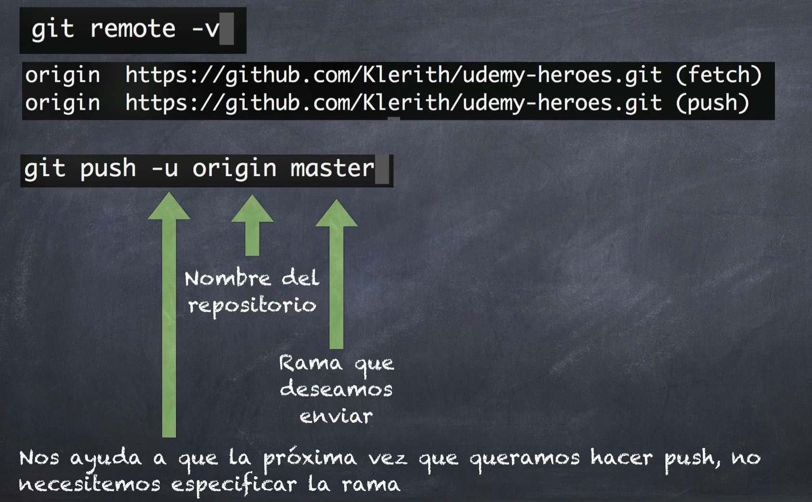

# **COMANDOS DE GIT**

### **GIT --VERSION**
Ver la version que tienes instalada en el dispositivo.

       git -v

### **GIT HELP**
Git muestra todos los comandos disponibles.

       git help

## **CONFIGURACIÓN DE GIT**

## **GIT CONFIG**
Este comando va bien para establecer las opciones de configuración para instalar Git. Normalmente, solo es necesario usarlo inmediatamente después de instalar Git en un nuevo equipo de desarrollo.

       git -config

* **GIT CONFIG --GLOBAL USER.NAME** 
Configura el nombre que saldra en los commits.

       git config --global user.name "your_name"

* **GIT CONFIG --GLOBAL USER.EMAIL** 
Este ejemplo escribe el valor your_email@example.com en el nombre de configuración user.email. La marca --global la usa para que se defina este valor para el usuario actual del sistema operativo.

git config --global user.email "your_email@example.com"

**GIT CONFIG --global -e**: 

       git config --global -e

**GIT CONFIG --global alias**:   Muestra o modifica los alias de los comando.

       git config --global alias."añadir_alias" "Añadir_comando_al_alias" 

 Por ejemplo para hacer un **status --short**.

       git config --global alias.s "status --short"

---

## **CREACION DE REPOSITORIO**

### **GIT INIT**
Inicializa un directorio local como un repositorio de git.

       git init

### **GIT ADD**
Mueve los cambios del directorio de trabajo al área del entorno de ensayo. Así puedes preparar una instantánea antes de confirmar en el historial oficial.

### **COMANDOS**

1. Agrega un archivo en especifico.

       git add nombre_del_archivo

2. Agrega todos los archivos del directorio actual a la.

       git add .

3. Para agregar archivos con extenciónes específicas, por ejemplo solo los **`HTML`**

       git add *.html
       

### **GIT COMMIT**
Confirma la instantánea preparada en el historial del proyecto. En combinación con git add, define el flujo de trabajo básico de todos los usuarios de Git.

       git commit -m "commit_message"

La opción -am es para hacer un commit de los cambios en el área de ensayo (stage) y agregar un mensaje de commit en una sola línea.

       git commit -am "commit_message"

### **GIT CHECKOUT**
Además de extraer las confirmaciones y las revisiones de archivos antiguas, git checkout también sirve para navegar por las ramas existentes. Combinado con los comandos básicos de Git, es una forma de trabajar en una línea de desarrollo concreta.
> Devuelve los archivos al ultimo commit, ( Solo los archivos que se les esta dando seguimiento por GIT )

        git checkout -- .

Para devolver un archivo en especifico al ultimo commit:

       git checkout -- "nombre_del_archivo"

### **GIT REMOTE**
Agrega o muestra el control remoto para una URL dada.
       
       git remote -v

### **GIT STATUS**
Lista un estado actual del repositorio con lista de archivos modificados o agregados.

       git status

**git log**: Muestra los logs de los commits realizados.

       git log

    
## **GIT BRANCH**
Se encarga de mostrar cuales son las ramas del proyecto.

       git branch

Para crear una rama usaremos este comando:
       
       git branch "nombre_de_la_rama"

Para cambiar de rama usaremos este comando:

       git checkout "nombre_de_la_rama"

Para crear y cambiar de rama usaremos este comando:

       git checkout -b "nombre_de_la_rama"

Para eliminar una rama usaremos este comando:

       git branch -d "nombre_de_la_rama"

Para eliminar una rama de manera forzada agregamos -f usaremos este comando:

       git branch -d "nombre_de_la_rama" -f

Para configurar la rama con la que queremos iniciar un proyecto utilizamos el siguiente comando:

       git config --global init.defaultBranch "nombre_de_la_rama"

## **GIT MERGE**
Este comando es para fusionar dos ramas en una sola.
       
       git merge "nombre_de_la_rama"

## **GIT ADD**

Mueve los cambios del directorio de trabajo al área del entorno de ensayo. Así puedes preparar una instantánea antes de confirmar en el historial oficial.

Este comando agrega todos los archivos del repositorio.
       
       git add .

## **GIT COMMIT**

Este comando se encarga de guardar cambios en el historial de Git.

Comentario sobre lo que se ha hecho y/o modificado.

       git commit -m "comment"
       
Modificar el mensaje del último commit con un nuevo mensaje.

       git commit --amend -m "update_message"
                
Deshacer el ultimo commit, pero sin perder los cambios realizados.

       git commit -m "comment" || "hash"

## **GIT PULL**
Es un comando de Git utilizado para actualizar la versión local de un repositorio desde otro remoto

### **COMANDOS**

1. Para traer los cambios a tu repositorio local (Fusionar).
       
       git pull
         
       git pull "nombre_del_repositorio" "rama_actual"
2. Configuraciones recomendadas.

       git config --global pull.ff only

### **CONFIGURACIONES RECOMENDADAS**

1. De esta manera solo se aplicara al proyecto/Repositorio actual.

       git config pull.rebase true
2. Con este comando se aplicara de manera global.

       git config --global pull.rebase true

**git reset --mixed**: Deshacer los últimos cambios realizados pero mantenerlos en la memoria para su uso posterior.

       git reset --mixed "hash_commit"

## **GIT TAG**
El comando **`git tag`** se utiliza para crear una etiqueta en un punto específico del historial de Git, generalmente para marcar una versión de lanzamiento. Las etiquetas son como ramas que no cambian, y se pueden usar para hacer referencia a un punto específico en el historial de Git. Puedes crear una lista de todas las etiquetas, eliminarlas, compartirlas y más con este comando.

Para ver los tag que tenemos:

       git tag

Para ver un `Tag` en especifico:

       git show "tag_name"

Para crear un tag:
>`[!IMPORTANT]` Creara un tag en el ultimo commit realizado.

       git tag "tag_name"

Para crear un tag anotado en un commit específico:
> [!NOTE]
> **`-a: `** Para que sea un tag anotado. **`-m: `** Para que tenga un nombre el tag.

       git tag -a "version_Ej: v0.1.0" "Hash_del_commit" -m "tag-name"

Para borrar el tag:
       
       git tag -d "tag-name"

> [!NOTE] 
> Las etiquetas anotadas se almacenan como objetos completos en la base de datos de Git. Para que quede claro, almacenan metadatos adicionales como los siguientes: el nombre de la persona que etiqueta, su correo electrónico y la fecha. Al igual que las confirmaciones y los mensajes de las confirmaciones, las etiquetas anotadas tienen un mensaje de etiquetado. Además, por seguridad, las etiquetas anotadas pueden firmarse y verificarse con GNU Privacy Guard (GPG). La práctica recomendada para el etiquetado de git es dar preferencia a las etiquetas anotadas por encima de las ligeras, para poder tener todos los metadatos asociados.

tag anotados:

       git tag -a "tag-name"

## **GIT RESET --HARD**
Elimina todos los cambios realizados después del hash indicado incluyendo el propio.

> [!NOTE]
> Tambien deja volver al commit anterior, pero sin perder los commits posteriores.

       git reset --hard "hash_del_commit"

## **GIT REFLOG**

Muestra la lista completa de referencias utiliz adas por Git para hacer checkout, branching o  revertir a commits anteriores.

       git reflog

## **GIT RM**

Para eliminar archivos o carpetas, utilizamos el siguiente comando:

       git rm "nombre_del_archivo_a_borrar"

## **GIT STASH** 

Guarda temporalmente los cambios que no se han confirmado aun y devuelve al directorio actual.

       git stash

Para guardar un stash con nombre

       git stash save "stash_name"

Para ver los cambios en un stash

       git stash show "hash_del_stash"

Para mostrar todos los stash guardados.

       git stash list

Para mostrar mas informacion en el stash list

       git stash list --stat

Trae los cambios que estan en el ultimo stash de tu directorio y borra el stash

       git stash pop

Para recuperar stash en especifico.

       git stash apply "hash_del_stash" || stash@{2}

Para elimina un stash en especifico.

       git stash drop "hash_del_stash"

Para limpiar todos los stash guardados.

       git stash clear

## **GIT REBASE**

> [!NOTE]
> El comando git rebase es una herramienta de Git que se utiliza para combinar dos o más ramas en una sola. A diferencia del comando git merge, que crea una nueva confirmación de combinación, git rebase mueve los cambios de una rama a otra de manera lineal, sin crear una nueva confirmación de combinación.

       git rebase

Para unir commits **( UNO DE LOS MAS USADOS )**:
> **-i** : Significa  interactivo, te permite editar cada commit antes de aplicarlo. 
> **HEAD** : Es una referencia al último commit de la rama actual 
> **~** : Este caracter se usa para señalar la cantidad de commits a los que se les aplicara el rebase.

       git rebase -i HEAD~4

- **`reword`**: Cambia el mensaje del commit sin tocar el codigo. 

- **`edit`**:

Para finalizar un rebase interactivo

       git rebase --continue

<!-- 
- Ordenar commits
- Corregir mensajes de los commits
- Unir commits
- separar commits -->

---

## **PALABRAS O SIGNOS CLAVES**

* **Commit**: Es una captura instantánea del estado actual.
* **Merge**: Es la unión de dos o más ramas.
* **Fast-forward**: Union sin problemas ya que no existen commits en la rama a la cual unimos los cambios.
* **??**: No se le esta dando seguimiento al archivo en el repositorio.
* **Stash**: Es una forma de guardar temporalmente los cambios locales sin tener que hacer un commit. Esto es útil cuando necesitas cambiar de rama o hacer otro cambio sin perder los cambios que has hecho.
* **Squash**: Unir varios commits en uno solo.
* **Pull**: Traer los datos que se encuentran en el origen del repositorio.

---
 

## **CONFIGURACIONES DE ALIAS RECOMENDADAS**

Este alias te mostarara de forma resumida y visualmente los commits hechos.

       git config --global alias.lg "log --graph --abbrev-commit --decorate --format=format:'%C(bold blue)%h%C(reset) - %C(bold green)(%ar)%C(reset) %C(white %s%C(reset) %C(dim white)- %an%C(reset)%C(bold yellow)%d%C(reset)' --all"